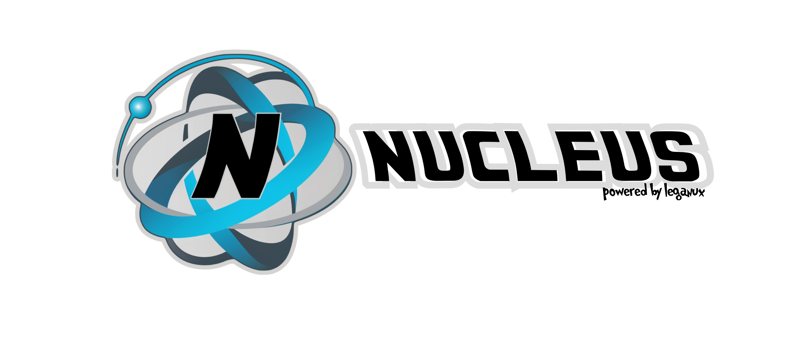

<center>

</center>

# NucleusJS by Leganux


## Introduction

Over time at Leganux, we have developed a series of internal tools that allow our internal team to provide quality
service to our clients in a very straightforward manner.

Among the main tools are:

- **Apiato**: A library for SQL/noSQL (mongoDB) that allows creating CRUDS in just a couple of minutes for RESTful APIs.
- **Apied-piper**: A microservices generator based on Apiato, with authentication.
- **Endframe Functions**: Cloud function system.
- **Slice-line**: A wrapper for automating email sending.
- **Tres-comas**: A wrapper for file uploading to AWS.
- And many more...

All these tools have served to make development fast, standardized, and with Node.js and JavaScript.

Some time ago, we began to build the evolution of all these tools in an integrated way as the core of our services.

Thus Leganux/Nucleus was born...

Nucleus is the all-in-one rapid development tool, now publicly available and complemented with artificial intelligence,
powered by OpenAI, for rapid development.

But what is Nucleus?

Essentially, it is a CLI that has various functionalities, among which stand out:

1. **Make**: Essential for creating software templates, regardless of the language. You can create templates that serve
   as base projects or add-ons.
2. **Execute**: With this function, you can use an existing template to initialize a new project or add features to an
   existing one.
3. **Json**: You can create a template in JSON format that automates the deployment and creation of a project with
   various steps automatically.
4. **AI**: With this functionality, you can ask artificial intelligence to help you generate a project. It can assist
   you up to 90%.

It also includes around 20 initial templates so you can start rapid development and see examples of how to build your
own templates.

And soon, a public repository will be available to share templates with the rest of the community.

## Installation

To install you must to have installed following requirements

* UNIX-LIKE System
* NodeJS v20 +
* NPM

**Install**

```
npm install @leganux/nucleus -g
```

**Get started**

This action will configure the default folder to store templates, and download started templates from GitHub,
By default creates .nucleusjs folder to save configuration un USER Folder Home, and creates nucleus folder for store templates

```
nucleusjs configure
```

**List default templates**

This action list the default templates that are installed in your system 

```
nucleusjs list
```

**Create a new template**

Wil execute the wizard to create a new template

```
nucleusjs make
```

**Execute**
This action execute a template to set up code in your actual path folder, be carefull 

```
nucleusjs execute
```

### JSON Template 

You can make a JSON file runner to execute many steps to construct automatically an application

***Example of JSON RUNNER for library***

library.runner.json this template creates a project example for a library to store books

1. Step 1 : Creates base project
2. Step 2 : Creates table model database with fields based on the JSON file

```JSON
{
  "name": "library",
  "description": "This JSON allows you to execute automatically the creation of virtual library",
  "steps": [
    {
      "name": "Install template",
      "description": "Install base project based on MVC noSQL",
      "template": "nucleus_FULL_Modules_noSQL",
      "values": {
        "replacer": {
          "name_project": "library",
          "db_connection": "mongodb://localhost/library",
          "api_port": 8000,
          "jwt_secret": "This is my secret",
          "cookie_session_secret": "This is my secret"
        }
      }
    },
    {
      "name": "Create Library table",
      "description": "Install new model for library and configure model",
      "template": "nucleus_model_FULL_Modules_noSQL_generator",
      "values": {
        "replacer": {
          "field_generator": [
            {
              "name": "name",
              "description": "The name of book",
              "customName": "Name",
              "type": "string",
              "mandatory": false,
              "isPassword": false
            },
            {
              "name": "description",
              "description": "The description of book",
              "customName": "Description",
              "type": "string",
              "mandatory": false,
              "isPassword": false
            },
            {
              "name": "stock",
              "description": "The stock of book",
              "customName": "Stock",
              "type": "number",
              "mandatory": false,
              "isPassword": false
            },
            {
              "name": "price",
              "description": "The price of book",
              "customName": "Price",
              "type": "number",
              "mandatory": false,
              "isPassword": false
            }
          ],
          "model_name_file": "library",
          "model_name_variable": "library"
        },
        "appendix": {
          "routes_name": [
            {
              "api_path": "library"
            }
          ],
          "view_fragment": [
            {
              "view_path": "library"
            }
          ],
          "view_menu": [
            {
              "view_path": "library",
              "title": "Books",
              "fa_icon": "fas fa-user"
            }
          ]
        }
      }
    }
  ]
}


```

``` txt

>> Descripción General del JSON RUNNER

El JSON RUNNER es un archivo que define una serie de pasos para automatizar la creación de una aplicación. Cada paso describe una tarea específica que se realizará durante el proceso de creación. A continuación, se detallan los parámetros y elementos que componen un JSON RUNNER:

- name (Nombre)
    Descripción: Nombre del JSON RUNNER.
    Tipo de Valor: String.
    Ejemplo: "library".

- description (Descripción)
    Descripción: Descripción del propósito del JSON RUNNER.
    Tipo de Valor: String.
    Ejemplo: "This JSON allows you to execute automatically the creation of a virtual library".

- steps (Pasos)
    Descripción: Lista de pasos que conforman el JSON RUNNER.
    Tipo de Valor: Array de Objetos.
    Ejemplo: Ver la descripción detallada de steps a continuación.
    Descripción Detallada de steps (Pasos)
    Los pasos representan las tareas individuales que se realizarán durante la ejecución del JSON RUNNER. Cada paso tiene varios atributos que definen cómo se realizará la tarea. A continuación, se describen los elementos que componen cada paso:

        -- name (Nombre)
                Descripción: Nombre del paso.
                Tipo de Valor: String.
                Ejemplo: "Install template".
        -- description (Descripción)
                Descripción: Descripción detallada de la tarea que se realizará en este paso.
                Tipo de Valor: String.
                Ejemplo: "Install base project based on MVC noSQL".
        -- template (Plantilla)
                Descripción: Nombre de la plantilla que se utilizará para este paso.
                Tipo de Valor: String.
                Ejemplo: "nucleus_FULL_Modules_noSQL".
        -- values (Valores)
                Descripción: Valores específicos que se utilizarán durante la ejecución de este paso.
                Tipo de Valor: Objeto.
                Ejemplo: Ver la descripción detallada de values a continuación.
                Descripción Detallada de values (Valores)
                Los valores son datos específicos que se utilizarán para personalizar el proceso de creación de la aplicación durante un paso particular. A continuación, se describen los elementos que pueden estar presentes en el objeto values:

                    --- replacer (Reemplazador)
                            Descripción: Valores que se utilizarán para reemplazar marcadores de posición en la plantilla.
                            Tipo de Valor: Objeto.
                            
                    --- appendix (Apéndice)
                            Descripción: Datos adicionales que se agregarán o utilizarán durante el proceso de creación de la aplicación.
                            Tipo de Valor: Objeto.
                           
Note: Values for replacers (v,n) cannot be objects, for functions(f) must be array of objects                           
                           
```

** Note: To know what values or parameters are valid for JSON runner, you must to check it out the config file of every template 


**Execute and use a template to your projects based on a JSON template**

```
nucleusjs json -p /path/to/jsonfile.runner.json  //the path of JSON must be absolute
```

### AI Powered Wizard
Now includes a wizard to automatically generate projects based on the standard, before you can execute AI wizard. 
You must to get the OpenAI Secret Key. Visit https://platform.openai.com/api-keys 

then when you have it install as follow

**Set up OpenAi Key**

```
nucleusjs configure -ai sk-h46s..............
```

**Create a project automatically using IA with OpenAI**

When you execute this action AI powered wizard will run, only you need to answer all questions, finally you receive a runner JSON file ant the complete execution of system you request for
```
nucleusjs ai
```


*Coming soon*

To share a template in our website as public template

```
nucleusjs publish
```

To use a template from website of the community

```
nucleusjs use
```

## Now an easy example to configure your first project

```
nucleusjs execute -n nucleus_FULL_Modules_SQL
```

Follow the instructions, and then

```
npm run dev
```

For API Docs visit

https://github.com/leganux/apiatojs

For SDK visit

https://github.com/leganux/code-rag-sdk

For Fake request module visit

https://github.com/leganux/ex-js-faker-request

For more projects visit

https://github.com/leganux/

<hr>


<p align="center">
    
    <br>
  Nucleus is another project of  <a href="https://leganux.net">leganux.net</a> &copy; 2021 all rights reserved
    <br>
   This project is distributed under the MIT license. 
    <br>
    Special thanks to all developers that work for his contribution to this development.
<br>
    The project was made with ♥️ by Angel Erick Cruz Olivera and leganux team
<br>
<br>
The logo and the name of Nucleus is inspired by the name of Nucleus, the fictional company, from the HBO series, Silicon Valley. This inspiration was taken for fun purposes only. The original name and logo reserve their rights to their original creators. 
</p>
